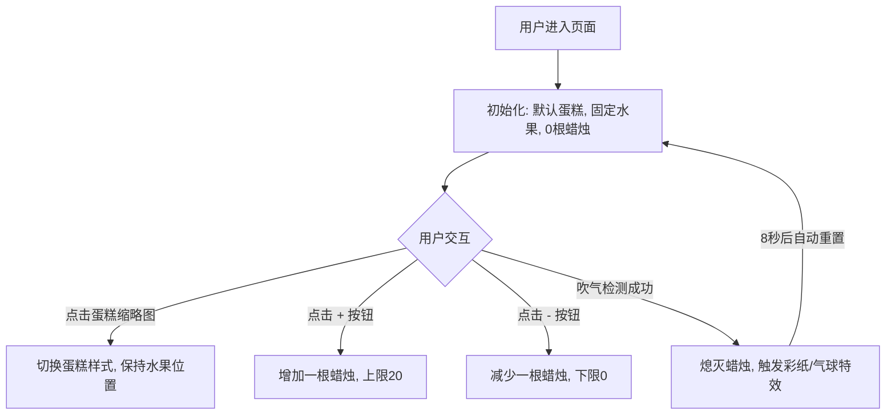

# “模拟吹生日蛋糕蜡烛”手机网页架构设计方案

## 1. 技术栈定义

为了确保在手机端浏览器（iOS Safari, Android Chrome, 微信内置浏览器等）的最佳兼容性与性能，建议采用以下技术栈：

- **前端框架**: 原生 HTML5 / CSS3 / JavaScript (ES6+)。不使用重型框架以减少首屏加载时间。
- **交互实现**: DOM 元素操作。利用 CSS3 `transform` 和 `transition` 处理位移与缩放。
- **音频处理**: **Web Audio API**。用于实时分析麦克风输入的音量。
- **动画效果**:
  - **CSS Keyframes**: 用于气球上升、蜡烛火焰跳动。
  - **Canvas Confetti**: 用于吹灭后的彩纸屑特效（轻量级库或原生实现）。
- **手势支持**: 原生 `click` / `touchstart` 事件。

---

## 2. 文件结构设计

```text
/birthday-cake
├── index.html              # 主入口文件
├── css/
│   ├── main.css            # 基础布局与 UI 样式（包含蛋糕切换、控制面板）
│   └── animations.css      # 蜡烛火焰、气球、彩纸动画
├── js/
│   ├── main.js             # 初始化与流程控制
│   ├── audio-detector.js   # 吹气检测模块 (Web Audio API)
│   ├── interaction.js      # 蛋糕切换、蜡烛增减、水果放置逻辑
│   └── effects.js          # 吹灭后的特效触发
└── assets/
    ├── images/
    │   ├── cake-1.png      # 蛋糕样式 1
    │   ├── cake-2.png      # 蛋糕样式 2
    │   ├── cake-3.png      # 蛋糕样式 3
    │   ├── candle-on.png   # 点燃的蜡烛
    │   ├── candle-off.png  # 熄灭的蜡烛
    │   ├── fruit-1.png     # 草莓
    │   ├── fruit-2.png     # 蓝莓
    │   └── balloon.png     # 气球
    └── audio/
        ├── bgm.mp3         # 背景音乐 (祝你生日快乐)
        ├── blow.mp3        # 吹气成功音效
        └── cheer.mp3       # 欢呼声
```

---

## 3. 核心功能实现说明

### 3.1 吹气检测 (Audio Detection)

利用 Web Audio API 监听麦克风音量：

1. **获取权限**: 调用 `navigator.mediaDevices.getUserMedia({ audio: true })`。
2. **音频分析**:
   - 创建 `AudioContext` 和 `AnalyserNode`。
   - 将麦克风流连接到分析器。
   - 使用 `requestAnimationFrame` 循环调用 `getByteFrequencyData`。
3. **阈值判定**:
   - 计算频率数据的平均值（音量）。
   - 当音量连续 N 帧超过预设阈值（如 50-80，视环境噪音而定）时，判定为“吹气”动作。
   - **注意**: 移动端 Web Audio API 必须由用户点击行为（如“开始”按钮）触发启动。

### 3.2 蛋糕样式切换

1. **交互**: 页面底部提供蛋糕缩略图列表，点击即可切换。
2. **实现**:
   - 维护一个 `currentCakeType` 状态。
   - 切换时更新蛋糕主图的 `src`。
   - **自动重置**: 切换蛋糕时，自动清空当前蜡烛，并根据新蛋糕样式重新放置固定数量的水果。

### 3.3 蜡烛增减控制 (+/- 按钮)

1. **交互**: 提供 `+` 和 `-` 两个按钮。
2. **实现**:
   - **增加 (+)**: 点击后在蛋糕顶部预设的路径上新增一根蜡烛。上限 20 根。
   - **减少 (-)**: 点击后移除最后一根添加的蜡烛。下限 0 根。
   - **自动排列算法**:
     - **路径定义**: 在蛋糕顶部定义一个椭圆形路径（符合透视效果）。
     - **动态分布**:
       - 当蜡烛数量变化时，所有蜡烛根据当前总数 `N`，平分椭圆路径的周长，计算出每根蜡烛的 `(x, y)` 坐标。
       - 这样可以确保无论有多少根蜡烛，它们在蛋糕顶部的分布始终是均匀且对称的。
     - **层级处理**: 根据 `y` 坐标动态调整每根蜡烛的 `z-index`，确保视觉上“靠后”的蜡烛被“靠前”的蜡烛正确遮挡。

### 3.4 水果固定放置

1. **逻辑**: 水果不再支持手动拖拽，改为随蛋糕样式自动生成。
2. **实现**:
   - 在配置文件中为每种蛋糕定义一组 `fruitPositions` (x, y 坐标数组)。
   - 切换蛋糕或初始化时，根据坐标数组在蛋糕容器内生成对应的水果元素。

### 3.5 吹灭后的特效与重置

1. **状态切换**: 吹气成功后，所有蜡烛火焰熄灭。
2. **特效**: 触发全屏彩纸 (Confetti) 和气球上升动画。
3. **重置功能**: 吹灭后 8 秒自动恢复到初始状态（默认蛋糕、0 根蜡烛、背景音乐重启）。

---

## 4. 资源清单 (Detailed Resource List)

### 4.1 图片资源 (Images)
所有图片建议使用 `.png` 格式以支持透明度，或使用 `.svg` 以获得最佳清晰度。

- **蛋糕样式 (Cake Styles)**:
  - `cake-1.png` 到 `cake-5.png`: 建议尺寸 600x600px。需包含完整的蛋糕主体，建议采用半透视视角（Top-down 45度），确保顶部有足够的空间放置蜡烛和水果。
- **装饰物 (Decorations)**:
  - `fruit-1.png` (草莓): 建议尺寸 100x100px，去底透明。
  - `fruit-2.png` (蓝莓/樱桃): 建议尺寸 100x100px，去底透明。
  - `candle-stick.png`: 建议尺寸 40x150px。蜡烛主体，建议带有彩色条纹。
  - `candle-off.png`: 熄灭后的蜡烛状态（可选，若使用 CSS 熄灭火焰则不需要）。
- **特效与氛围 (Effects)**:
  - `balloon.png`: 建议尺寸 150x200px。包含气球主体和下方的细线。建议提供红、黄、蓝等多种颜色版本。
  - `confetti-shapes.png`: 各种形状的彩纸屑（圆形、长方形、星形）。
- **UI 元素 (UI Elements)**:
  - `btn-plus.png` / `btn-minus.png`: 建议尺寸 120x120px。加减按钮图标。

### 4.2 音频资源 (Audio)
建议使用 `.mp3` 格式以平衡音质与文件大小。

- **背景音乐 (BGM)**:
  - `bgm.mp3`: 祝你生日快乐（乐器版）。建议时长 30-60s，需支持循环播放。音量建议预设在 50% 左右。
- **交互音效 (SFX)**:
  - `click.mp3`: 点击按钮、切换蛋糕时的清脆反馈音。
  - `blow-success.mp3`: 吹气成功瞬间的音效（如“呼”的一声或魔法闪烁音）。
  - `cheer.mp3`: 吹灭后的欢呼声、掌声。建议时长 3-5s。
  - `firework.mp3`: 彩纸喷出时的轻微爆裂音（可选）。

---

## 5. 移动端优化建议

- **视口锁定**: 使用 `meta viewport` 禁止缩放。
- **点击延迟**: 使用 `touch-action: manipulation` 消除移动端 300ms 点击延迟。
- **资源预加载**: 在用户点击“开始”进入页面时，预加载所有蛋糕样式图片，确保切换流畅。

---

## 6. 交互流程图


